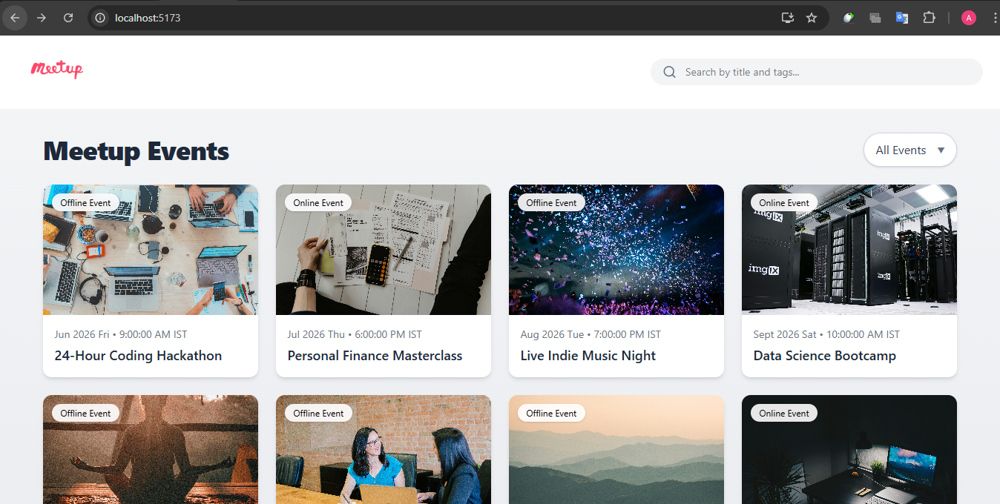
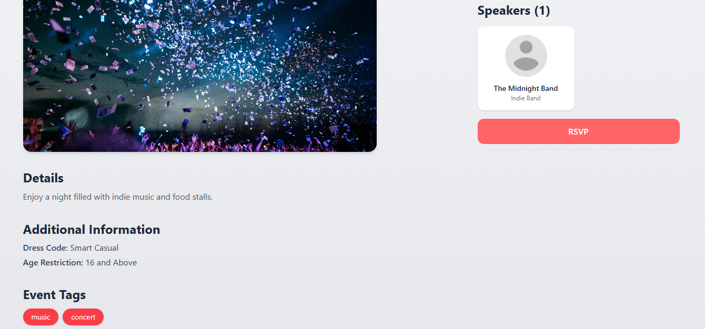
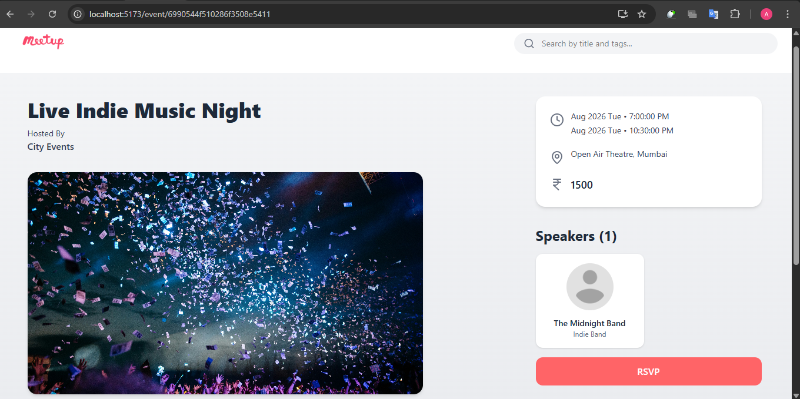

# Meetup Events

<div align="center">
  
  <h1>Meetup Events</h1>
  <p><strong>A full-stack application for browsing, filtering, and managing community events.</strong></p>
</div>

---

## 📖 Overview

**Meetup Events** is a modern web application designed to help users discover and explore various events, whether they are online or offline. Built with a robust **React** frontend and a scallable **Node.js/Express** backend, it offers a seamless experience for viewing event details, speakers, schedules, and pricing.

The application features a clean, responsive UI styled with **Tailwind CSS**, ensuring accessibility across devices.

## ✨ Features

- **Browse Events**: View a curated list of upcoming community events.
- **Smart Filtering**: easily filter events by type (**Online** or **Offline**).
- **Search Functionality**: Quickly find specific events by title or tags.
- **Detailed Event View**: Access comprehensive information including:
    - Event description and agenda
    - Speaker profiles
    - Date, time, and location
    - Pricing and ticket information
    - Dress code and age restrictions
- **Responsive Design**: Fully optimized for desktops, tablets, and mobile devices.

## 🛠️ Tech Stack

### Frontend
- **Framework**: [React](https://react.dev/) (Vite)
- **Styling**: [Tailwind CSS](https://tailwindcss.com/)
- **Routing**: [React Router](https://reactrouter.com/)
- **Icons**: [Lucide React](https://lucide.dev/)

### Backend
- **Runtime**: [Node.js](https://nodejs.org/)
- **Framework**: [Express.js](https://expressjs.com/)
- **Database**: [MongoDB](https://www.mongodb.com/) with [Mongoose](https://mongoosejs.com/)
- **Validation**: Mongoose Schemas

## 📸 Screenshots & Demo

### 🎥 Demo Video

<video src="https://github.com/user-attachments/assets/635c6b32-05d2-486f-b82b-adb16055a8ec" controls="controls" style="max-width: 100%;"></video>
*(Download or View Raw on GitHub)*

### 🖼️ Application Interface

| Home Page |
|:---:|
|  |

| Event Details (Bottom) | Event Details (Top) |
|:---:|:---:|
|  |  |

## 🚀 Installation & Setup

Follow these steps to set up the project locally.

### Prerequisites
- Node.js (v14 or higher)
- MongoDB installed locally or a MongoDB Atlas connection string

### 1. Clone the Repository
```bash
git clone <repository-url>
cd <repository-directory>
```

### 2. Backend Setup
Navigate to the backend directory and install dependencies.

```bash
cd backend
npm install
```

Create a `.env` file in the `backend` directory and add your MongoDB connection string and port:

```env
PORT=3000
MONGODB_URI=your_mongodb_connection_string
```

Start the backend server:

```bash
npm run dev
```
*The server will start on `http://localhost:3000`*

### 3. Frontend Setup
Open a new terminal, navigate to the frontend directory, and install dependencies.

```bash
cd frontend
npm install
```

Start the development server:

```bash
npm run dev
```
*The application will be accessible at `http://localhost:5173` (or the port shown in your terminal)*

## 🔗 API Endpoints

| Method | Endpoint | Description |
| :--- | :--- | :--- |
| `GET` | `/events` | Fetch all available events |
| `GET` | `/events/:id` | Fetch details for a specific event |

## 🤝 Contributing

Contributions are welcome! Please feel free to submit a Pull Request.
